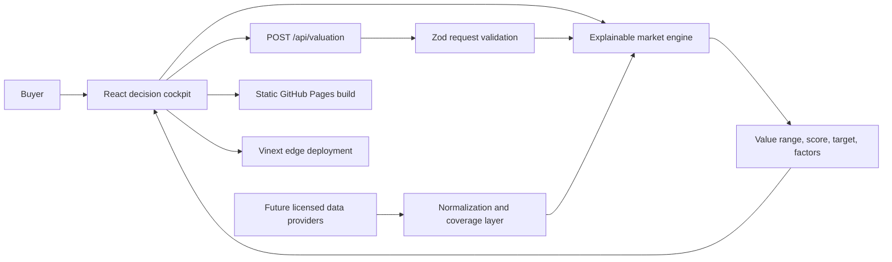

# AutoLens AI

AutoLens AI is an interactive automobile-buying intelligence dashboard for comparing new and used vehicles. It brings market pricing, vehicle-history signals, reliability, recalls, projected maintenance costs, alternatives, price targets, and negotiation guidance into one responsive decision view.

The repository contains a full-stack edge application and a static GitHub Pages build. The current dataset is intentionally labeled as modeled sample data. Production use requires live, licensed provider integrations.

## What the application does

- Searches by manufacturer, model, condition, ZIP code, and radius.
- Compares local listings and supports sorting by match, price, or mileage.
- Produces an explainable fair-value range, confidence score, deal score, and price verdict.
- Adjusts valuation for year, mileage, trim, region, search radius, condition, and reported damage.
- Displays title, accident, ownership, service, and masked-VIN history signals.
- Shows model reliability, open-recall counts, expected lifespan, and long-term repair context.
- Forecasts one-, three-, and five-year service and maintenance costs.
- Breaks ownership forecasts into routine service, wear items, and repair reserve.
- Estimates upcoming maintenance milestones from current mileage.
- Suggests comparable alternative models with price and reliability differences.
- Calculates a realistic negotiation target and potential savings.
- Generates a copyable out-the-door negotiation script and buying playbook.
- Supports saved-search and price-alert interactions in the current browser session.
- Adapts to desktop, tablet, and mobile layouts with accessible controls.

## Product boundaries

AutoLens AI currently demonstrates the complete product experience with deterministic sample data. It does **not** claim that the displayed listing prices, VIN history, recalls, or maintenance forecasts are live facts.

| Capability | Current implementation | Production requirement |
| --- | --- | --- |
| Listings | Modeled local inventory | Licensed active and recently removed listing feed |
| Valuation | Deterministic explainable engine | Normalized comparable-sales pipeline and calibrated model |
| VIN/title history | Clearly labeled demo records | NMVTIS-compatible provider and complete VIN lookup |
| Accidents/service | Modeled history signals | Contracted history provider with coverage reporting |
| Recalls | Modeled counts | NHTSA recall/campaign lookup using the complete VIN |
| Maintenance | Mileage- and model-based forecast | Manufacturer schedules, localized labor, parts, and condition data |
| Recommendations | Deterministic comparison rules | Broader catalog, inventory availability, preferences, and ownership-cost data |
| Negotiation guidance | Rule-based target and playbook | Fees, taxes, financing, inspection, and dealer-specific context |

Missing provider coverage must always be presented as **unknown**, never as a clean history or a confirmed absence of accidents.

## Architecture



The valuation engine is deterministic and explainable. An LLM is not required for core pricing, history, recall, or maintenance decisions. A future LLM may help summarize evidence or personalize negotiation language, but factual outputs should remain provider-backed and auditable.

## Technology stack

- React 19 and Next.js 16 application components
- Vinext and Vite for edge-compatible builds and local development
- TypeScript for application and API code
- Zod for valuation API input validation
- Lucide React for the icon system
- Cloudflare Vite plugin and Wrangler-compatible worker runtime
- Native Node test runner for rendered-output verification
- ESLint with the Next.js configuration
- GitHub Actions and GitHub Pages for static deployment

## Repository structure

```text
autolens-ai/
├── app/
│   ├── api/valuation/route.ts   # Validated valuation API
│   ├── globals.css              # Responsive dashboard design system
│   ├── layout.tsx               # Metadata and root layout
│   └── page.tsx                 # Main interactive cockpit
├── github-pages/
│   ├── index.html               # Static application entry document
│   └── main.tsx                 # React client entry for Pages
├── lib/
│   └── market-engine.ts         # Explainable valuation logic
├── public/                      # Favicons and social preview image
├── tests/
│   └── rendered-html.test.mjs   # SSR and deployability checks
├── worker/
│   └── index.ts                 # Edge worker entry point
├── .github/workflows/
│   └── deploy-pages.yml         # GitHub Pages deployment workflow
├── vite.config.ts               # Full-stack Vinext configuration
└── vite.pages.config.ts         # Static Pages build configuration
```

## Prerequisites

- Node.js 22.13 or newer
- npm
- Git, if contributing or publishing

No API keys or provider credentials are required to run the modeled demo.

## Local development

Install dependencies:

```bash
npm install
```

Start the development server:

```bash
npm run dev
```

Open `http://localhost:3000`.

## Available scripts

| Command | Purpose |
| --- | --- |
| `npm run dev` | Starts the Vinext development server |
| `npm run build` | Produces the full-stack edge build in `dist` |
| `npm run build:pages` | Produces the static GitHub Pages build in `dist-pages` |
| `npm run start` | Starts the built full-stack application |
| `npm test` | Builds the app and runs the server-rendered verification suite |
| `npm run lint` | Runs ESLint across the source tree |

## Valuation API

The full-stack application exposes `POST /api/valuation`.

Example request:

```json
{
  "make": "Toyota",
  "model": "RAV4",
  "trim": "XLE",
  "year": 2021,
  "mileage": 47281,
  "askingPrice": 24890,
  "zip": "80206",
  "radius": 50,
  "condition": "used",
  "accidentCount": 0
}
```

Example response shape:

```json
{
  "valuation": {
    "fairValue": 24020,
    "lowRange": 22700,
    "highRange": 25510,
    "targetPrice": 23180,
    "dealScore": 63,
    "verdict": "Fair price",
    "confidence": 92,
    "savingsVsMarket": -870,
    "factors": [
      { "label": "Mileage vs. local comps", "impact": 780 },
      { "label": "Trim and equipment", "impact": 900 },
      { "label": "Regional market demand", "impact": 430 },
      { "label": "Reported history", "impact": 0 }
    ]
  },
  "methodology": "Comparable-market baseline adjusted for age, mileage, trim, region, and reported history.",
  "generatedAt": "ISO-8601 timestamp"
}
```

Invalid payloads return HTTP `400` with field-level validation errors. The static Pages build cannot host this server route and therefore retains the deterministic client-side calculation for the demo experience.

## How the modeled valuation works

The engine in `lib/market-engine.ts`:

1. Selects a model MSRP baseline.
2. Applies retained-value depreciation based on age and condition.
3. Compares actual mileage with an expected annual-mileage curve.
4. Applies trim, regional-demand, radius, and reported-history adjustments.
5. Generates a fair value plus low and high bounds.
6. Scores the asking-price delta and assigns a price verdict.
7. Produces an opening negotiation target and factor-level explanation.

This is an explainability-focused reference implementation, not a substitute for a trained and backtested production valuation model.

## Maintenance forecast

The ownership-cost card supports one-, three-, and five-year horizons. It combines model-specific annual estimates with mileage milestones, then presents:

- Projected total and likely cost range
- Recommended monthly reserve
- Difference from a comparable-SUV baseline
- Annual cost bars
- Routine-service, wear-item, and repair-reserve allocation
- Likely upcoming services and estimated timing

Actual ownership costs vary with vehicle condition, driving behavior, geography, labor rates, parts inflation, warranty coverage, and prior maintenance. Production estimates should use manufacturer schedules and a licensed maintenance-cost dataset.

## Testing and quality checks

Run the complete release gate:

```bash
npm test
npm run build:pages
npm run lint
```

The current verification suite checks that:

- The full-stack application builds successfully.
- The main route server-renders with the expected product sections.
- Search controls, listings, maintenance, negotiation, and social metadata are present.
- The valuation route validates input and calls the shared market engine.
- The static Pages configuration and deployment workflow remain available.
- Removed starter artifacts are not accidentally reintroduced.

The application has also been manually exercised across desktop and mobile breakpoints for search, new/used switching, ZIP validation, listing sorting, vehicle selection, damage-aware history, maintenance horizons, alternatives, negotiation controls, clipboard copy, dialogs, and responsive navigation.

## GitHub Pages deployment

The workflow in `.github/workflows/deploy-pages.yml` deploys on every push to `main` and can also be started manually.

Repository configuration:

1. Open **Settings → Pages**.
2. Set **Source** to **GitHub Actions**.
3. Push to `main` or run the Pages workflow manually.
4. Wait for the `Deploy AutoLens AI to GitHub Pages` workflow to finish.

The Vite configuration derives the correct project-site base path from `GITHUB_REPOSITORY`, so assets work under a repository subpath.

## Full-stack deployment

Build the Vinext edge application with:

```bash
npm run build
```

The resulting `dist` directory contains the server and client bundles used by the edge deployment. Unlike the static Pages surface, this deployment can execute `/api/valuation` and can later host protected provider adapters.

## Credential and privacy safety

The repository must never contain usernames, passwords, provider tokens, API keys, private keys, session cookies, complete VIN-report credentials, or local environment files.

- `.env*`, private keys, local runtime state, dependencies, and build output are ignored.
- GitHub authentication is stored by the GitHub CLI in the operating-system keychain, outside the project.
- Production credentials belong in GitHub Actions secrets or encrypted hosting environment variables.
- Paid-provider and secret-bearing requests must execute through the server API, never directly in the browser.
- Logs and error responses must not include credentials or full sensitive provider payloads.
- Commit metadata should use a GitHub-protected `noreply` email address.

Recommended future environment-variable names may be documented in an `.env.example`, but that example must contain placeholders only—never real values.

## Production data roadmap

1. Integrate NHTSA vPIC for VIN decoding and NHTSA campaign data for recalls.
2. Contract a licensed marketplace provider for active, removed, and historical listings.
3. Add an NMVTIS-compatible title-history source and licensed accident/service coverage.
4. Normalize trim, equipment, mileage, condition, geography, dealer fees, and listing age.
5. Train and backtest a versioned valuation model with drift and confidence monitoring.
6. Add manufacturer maintenance schedules, localized labor rates, parts inflation, and warranty logic.
7. Store provider coverage and provenance with every fact shown to the buyer.
8. Add authentication, persistent saved searches, alert delivery, and user-controlled data deletion.
9. Add observability, provider retry policies, audit logs, and graceful unknown states.
10. Add automated accessibility, browser, API-contract, and security scanning in CI.

## Responsible-use note

AutoLens AI is decision support, not a guarantee of vehicle condition or final price. Buyers should verify the complete VIN, obtain an independent pre-purchase inspection, review title and recall records, confirm taxes and fees, and evaluate financing before completing a purchase.
